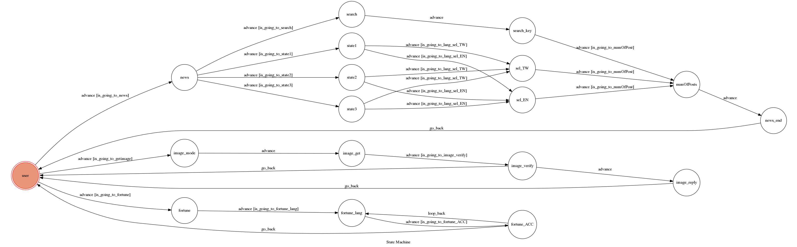

# ChatBot_Telegram

A telegram bot 

## Environment

* Ubuntu 16.04
* Python3

### Using library
* Flask
* transitions
* pygraphviz
* python-telegram-bot
* boto3 ( AWS SDK )
* gtts
* sqlite3
* beautifulsoup4

#### Install Dependency
```sh
pip install -r requirements.txt
```
### Defined module
* google_news.py
	- Grab news from google
### How to Run
using `ngrok` as a proxy.

```sh
ngrok http 5000
```

You should set `WEBHOOK_URL` (in app.py) to `your-https-URL/hook`.

#### Run the sever

```sh
python3 app.py
```

## Details for my ChatBot
### Three modes
* Instant News

	1. Choose a category

		- provide 3 categories
		- a search mode
	2. Choose preferred language
		- English
		- Chinese
	3. Number of stories to show
		- INPUT a Integer
	4. BOT sends stories

* Guide Dog

	1. Send a photo (NOT file)
	2. BOT sends back a voice clip
	3. BOT asks for feedbacks
	4. If there's a feedback, save it to the database

* Inspire my day
	1. Choose preferred language
		- English
		- Chinese
	1. BOT sends a Message to inspire you
	2. Choose if it is good enough 
		- YES
		- NO
	3. If user chooses 'NO', the BOT will resend a message

Each State provide custom keyboard inputs for users 


## Finite State Machine



